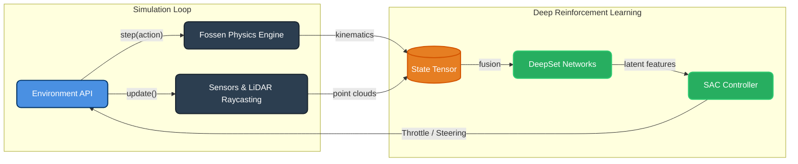
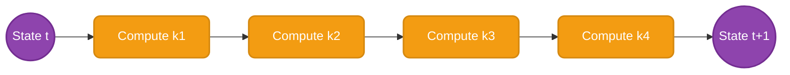
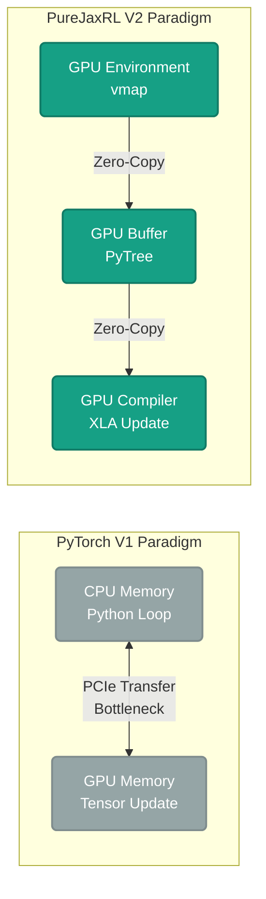

# RLSim: A High-Fidelity, JAX-Accelerated Multi-Agent Reinforcement Learning Environment for Autonomous Surface and Underwater Vehicles

## Abstract
This technical report details the architecture, dynamics, and deep learning algorithms powering **RLSim**, a state-of-the-art Multi-Agent Reinforcement Learning (MARL) simulator. Designed specifically for Autonomous Surface Vehicles (USVs) and Autonomous Underwater Vehicles (AUVs), RLSim bridges the gap between high-fidelity mathematical hydrodynamics (Fossen equations) and massive parallel execution for Deep RL. It features a dual-architecture paradigm: a CPU-bound Numba-accelerated PettingZoo environment (V1) and a pure-functional JAX-accelerated XLA engine (V2).

---

## 1. System Architecture

The environment relies on a highly modular design where the physics engine, perception modules (LiDAR/Radar), and reinforcement learning agents operate synchronously. The architecture is designed to handle heterogeneous swarms (e.g., REMUS 100 AUVs mixed with standard USVs) navigating dynamic obstacle fields.



---

## 2. Mathematical Dynamics Model (Fossen Equations)

To ensure simulation fidelity matches real-world oceanic conditions, the vehicles are modeled using the nonlinear rigid-body equations proposed by Fossen.

### 2.1 USV Dynamics (3-DOF)
The state of the vehicle is defined by its earth-fixed position $\boldsymbol{\eta} = [x, y, \psi]^\top$ and body-fixed velocities $\boldsymbol{\nu} = [u, v, r]^\top$.

The kinetic model is expressed as:
$$ \mathbf{M} \dot{\boldsymbol{\nu}} + \mathbf{C}(\boldsymbol{\nu}_r) \boldsymbol{\nu}_r + \mathbf{D}(\boldsymbol{\nu}_r) \boldsymbol{\nu}_r = \boldsymbol{\tau} $$

Where:
*   $\mathbf{M} \in \mathbb{R}^{3\times3}$: Inertia matrix (including added mass, $X_{\dot{u}}$, $Y_{\dot{v}}$, $N_{\dot{r}}$).
*   $\mathbf{C}(\boldsymbol{\nu}_r) \in \mathbb{R}^{3\times3}$: Coriolis and centripetal matrix.
*   $\mathbf{D}(\boldsymbol{\nu}_r) \in \mathbb{R}^{3\times3}$: Nonlinear hydrodynamic damping matrix containing linear and quadratic terms (e.g., $X_{u|u|}$).
*   $\boldsymbol{\nu}_r \in \mathbb{R}^3$: Relative velocity vector accounting for irrotational ocean currents.
*   $\boldsymbol{\tau} \in \mathbb{R}^3$: The control input vector computed via the actuator mapping:
    $$ \tau_u = \text{throttle} \times F_{max}, \quad \tau_r = \text{steering} \times M_{max} $$

### 2.2 Integration via RK4
To prevent numerical instability at high simulation speeds, a 4th-Order Runge-Kutta (RK4) integrator is employed, executed natively via `@jax.jit` or `@numba.njit`.



---

## 3. Multi-Agent Reinforcement Learning (MARL) Setup

The core decision-making algorithm is a **Soft Actor-Critic (SAC)** architecture designed specifically for Multi-Agent scenarios. The setup operates under the **Centralized Training with Decentralized Execution (CTDE)** paradigm.

### 3.1 CTDE Architecture
In a swarm of autonomous vehicles, agents must execute policies based solely on their local observations (Decentralized Execution). However, during training, the Critic has access to global state information (Centralized Training) to stabilize the learning process in a non-stationary multi-agent environment.

```mermaid
graph LR
    %% Styles
    classDef obs fill:#16A085,stroke:#117A65,stroke-width:2px,color:#fff,rx:15px,ry:15px
    classDef actor fill:#2980B9,stroke:#2471A3,stroke-width:2px,color:#fff,rx:5px,ry:5px
    classDef critic fill:#C0392B,stroke:#922B21,stroke-width:2px,color:#fff,rx:5px,ry:5px
    
    subgraph Execution Phase (Decentralized)
        O1(Local Obs 1):::obs --> A1[Actor 1]:::actor --> Act1(Action 1):::obs
        O2(Local Obs N):::obs --> A2[Actor N]:::actor --> Act2(Action N):::obs
    end
    
    subgraph Training Phase (Centralized)
        GS(Global State Array):::obs
        C1{Centralized Critic}:::critic
        Act1 --> C1
        Act2 --> C1
        GS --> C1
        C1 -.-> |Loss Gradients| A1
        C1 -.-> |Loss Gradients| A2
    end
```

---

## 4. Intricate Neural Network Topologies

RLSim's architecture employs highly specialized sub-networks to encode different modalities of the environment state before fusing them into a centralized latent vector. 

### 4.1 DeepSetOAB (LiDAR PointNet) & EntitySetEncoder
The LiDAR PointNet aggregates 64 spatial beams, while the EntitySetEncoder tracks $N$ dynamic neighbors permutation-invariantly.

```mermaid
graph LR
    %% Styles
    classDef layer fill:#34495E,stroke:#2C3E50,stroke-width:2px,color:#fff,rx:5px,ry:5px
    classDef data fill:#D35400,stroke:#A04000,stroke-width:2px,color:#fff,rx:15px,ry:15px

    subgraph DeepSetOAB (LiDAR Array Processing)
        L1(LiDAR Input [64, 2]):::data --> L2[Linear 32 <br/> ReLU]:::layer
        L2 --> L3[Linear 64 <br/> ReLU]:::layer
        L3 --> L4[Global Max Pool]:::layer
        L4 --> L5(Feature Tensor [64]):::data
    end

    subgraph EntitySetEncoder (Dynamic Neighbors)
        E1(Entities [N, 5]):::data --> E2[Phi Net <br/> Linear 64 <br/> ReLU]:::layer
        E2 --> E3[Mask Zero-Padding <br/> Mean Pool]:::layer
        E3 --> E4[Rho Net <br/> Linear 64]:::layer
        E4 --> E5(Feature Tensor [64]):::data
    end
```

### 4.2 Feature Extractor Backbone (ActorBackbone)
Fuses the disparate sensor streams into a single 256-dimensional latent representation for the SAC heads.

```mermaid
graph LR
    %% Styles
    classDef raw fill:#7F8C8D,stroke:#707B7C,stroke-width:2px,color:#fff,rx:10px,ry:10px
    classDef enc fill:#8E44AD,stroke:#732D91,stroke-width:2px,color:#fff,rx:5px,ry:5px
    classDef fuse fill:#C0392B,stroke:#922B21,stroke-width:2px,color:#fff,rx:5px,ry:5px

    subgraph Heterogeneous Sensor Streams
        K(Kinematics [8]):::raw --> K1[Linear 64 <br/> LayerNorm <br/> ReLU]:::enc
        G(Goal Vector [8]):::raw --> G1[Linear 32 <br/> LayerNorm]:::enc
        L(LiDAR [64, 2]):::raw --> L1[DeepSetOAB]:::enc
        N(Neighbors [N, 5]):::raw --> N1[EntitySetEncoder]:::enc
        O(Obstacles [M, 5]):::raw --> O1[EntitySetEncoder]:::enc
    end

    subgraph Backbone Fusion
        K1 --> F1[LayerNorm <br/> Concat]:::fuse
        L1 --> F1
        
        F1 --> F2[Concatenate <br/> All Vectors]:::fuse
        G1 --> F2
        N1 --> F2
        O1 --> F2
        
        F2 --> F3[Linear 256 <br/> ReLU]:::fuse
        F3 --> OUT(Actor Latent Space [256]):::raw
    end
```

### 4.3 Soft Actor-Critic (SAC) Heads
The latent vector from the Backbone is fed into the continuous policy and Q-value networks.

```mermaid
graph LR
    %% Styles
    classDef latent fill:#D35400,stroke:#BA4A00,stroke-width:2px,color:#fff,rx:15px,ry:15px
    classDef net fill:#2C3E50,stroke:#1A252F,stroke-width:2px,color:#fff,rx:5px,ry:5px
    classDef output fill:#27AE60,stroke:#1E8449,stroke-width:2px,color:#fff,rx:15px,ry:15px

    subgraph SoftQNetwork (Critic Value Prediction)
        C1(Latent State [256]):::latent --> C2[Concat]:::net
        A1(Action Sample [2]):::latent --> C2
        
        C2 --> C3[Linear 256 <br/> ReLU]:::net
        C3 --> C4[Linear 256 <br/> ReLU]:::net
        C4 --> C5[Linear 1]:::net
        C5 --> C6(Q-Value Score):::output
    end

    subgraph Policy Network (Continuous Actor)
        P1(Latent State [256]):::latent --> P2[Mean Branch <br/> Linear 2]:::net
        P1 --> P3[Log-Std Branch <br/> Linear 2 <br/> Clip -5, 2]:::net
        
        P2 --> P4[Reparameterized <br/> Normal Sample]:::net
        P3 --> P4
        
        P4 --> P5[Tanh Squash <br/> Action Scale]:::net
        P5 --> P6(Throttle & Steering):::output
    end
```

---

## 5. Hardware Acceleration paradigms

### 5.1 RLSim V1: The Numba Engine
The V1 architecture utilizes Python `multiprocessing` connected to a `gymnasium.vector.AsyncVectorEnv`. The core bottlenecks of physics and LiDAR raycasting are compiled to LLVM machine code using `@numba.njit(fastmath=True)`. This allows a 16-core CPU to simulate roughly 5,000 transitions per second.

### 5.2 RLSim V2: The JAX XLA Engine
To achieve millions of transitions per second, V2 shifts the entire simulation stack onto the GPU.
*   **Pure Functional State**: Objects are eliminated. The entire simulation state is a JAX PyTree `EnvState`.
*   **Massive Parallelization**: By wrapping the step function in `jax.vmap`, we process $N=10,000$ agents simultaneously in a single XLA-compiled CUDA instruction.
*   **GPU Replay Buffer**: The `JaxReplayBuffer` pre-allocates gigabytes of memory strictly on the GPU, completely eliminating the PCIe bandwidth bottleneck that plagues PyTorch-based RL.


